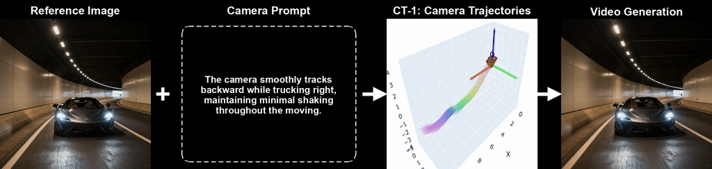
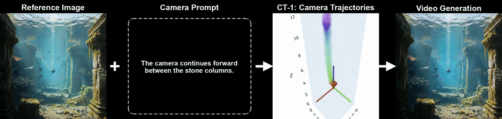
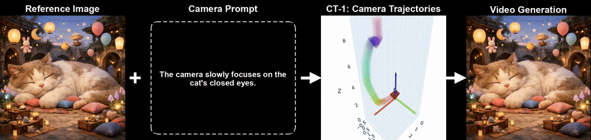
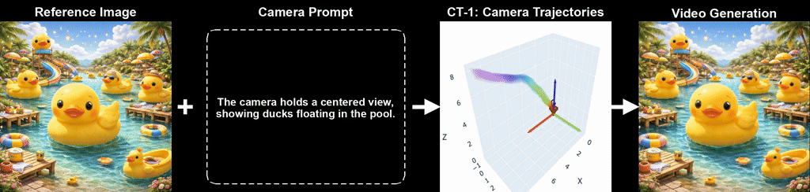

<div align="center">


<h2>
  CT-1: Vision-Language-Camera Models Transfer Spatial Reasoning Knowledge to Camera-controllable Video Generation
</h2>

<p>
  <a href="https://gulucaptain.github.io/Camera-Transformer-1/"></a>
  &nbsp;
  <a href="https://arxiv.org/abs/2604.09201"></a>
  &nbsp;
  <a href="https://github.com/gulucaptain/Camera-Transformer-1"></a>
</p>

<p>
  <strong>Haoyu Zhao, Zihao Zhang, Jiaxi Gu, Haoran Chen, Qingping Zheng, Pin Tang, Yeyin Jin, <br> Yuang Zhang, Junqi Cheng, Zenghui Lu, Peng Shu, Zuxuan Wu, Yu-Gang Jiang<br></strong>
  <em>Fudan University; Tencent.</em>
</p>

<p>
  
</p>

</div>

---

## 📋 Abstract

Camera-controllable video generation aims to synthesize videos with flexible and physically plausible camera movements. However, existing methods either provide imprecise camera control from text prompts or rely on labor-intensive manual camera trajectory parameters, limiting their use in automated scenarios. 

To address these issues, we propose a novel **Vision-Language-Camera model**, termed **CT-1 (Camera Transformer 1)**, a specialized model designed to *transfer spatial reasoning knowledge to video generation* by accurately estimating camera trajectories. Built upon vision-language modules and a Diffusion Transformer model, CT-1 employs a *Wavelet-based Regularization Loss* in the frequency domain to effectively learn complex camera trajectory distributions. These trajectories are integrated into a video diffusion model to enable spatially aware camera control that aligns with user intentions. 

To facilitate the training of CT-1, we design a dedicated data curation pipeline and construct **CT-200K**, a large-scale dataset containing over *47M frames*. Experimental results demonstrate that our framework successfully bridges the gap between spatial reasoning and video synthesis, yielding faithful and high-quality camera-controllable videos and improving camera control accuracy by 25.7% over prior methods.

---

## 🔥 News

| Date | Event |
|------|-------|
| 🟡 2026-04-10 | Project page released. Code coming soon. |

---

## 🧠 Framework Overview

CT-1 follows a **"Camera-Decision-First, Generation-Next"** two-stage paradigm:

```
Vision-Language Input (Image + Text)
          │
          ▼
  ┌───────────────────┐
  │  CT-1 (VLC Model) │  ← Diffusion Transformer + Wavelet Regularization Loss
  └───────────────────┘
          │
          ▼
   Camera Trajectories
          │
          ▼
  ┌─────────────────────────┐
  │  Video Diffusion Model  │  ← Camera controllable video generation
  └─────────────────────────┘
          │
          ▼
   Generated Video
```

The framework consists of three main components:
- **(a) Vision-Language Module** — for semantic embedding of image and text inputs
- **(b) Diffusion Transformer Module** — for modeling camera trajectory distributions with Wavelet-based Regularization Loss
- **(c) Controllable Video Generation Models** — synthesize videos conditioned on the predicted trajectories

---

## 🎬 Video Generation with CT-1

> **Challenging Scenarios** — Forward motion & rotational motion across diverse scenes.
>
> 🔁 *Animated previews below (GIF).*

<table>
  <tr>
    <td align="center"></td>
  </tr>
  <tr>
    <td align="center"></td>
  </tr>
  <tr>
    <td align="center"></td>
  </tr>
  <tr>
    <td align="center"></td>
  </tr>
</table>

> 💡 For full video demos including camera trajectory visualizations, cross-model comparisons, and driving scenarios, please visit our [**Project Page**](https://gulucaptain.github.io/Camera-Transformer-1/).

---

## ✨ Highlights

- 🎯 **VLC Model**: First to formulate camera trajectory estimation as a vision-language understanding task
- 🌊 **Wavelet-based Regularization Loss**: Novel frequency-domain loss for learning complex camera trajectory distributions
- 📦 **CT-200K Dataset**: Large-scale dataset with 47M+ frames and dedicated curation pipeline
- 🔌 **Cross-Model Compatibility**: CT-1 predicted trajectories are compatible with existing models (CameraCtrl, MotionCtrl, etc.)
- 🚗 **Cross-Domain Generalization**: Validated on general scenes and driving scenarios

---

## 💻 Code

> 🚧 **Coming Soon** — Code and model weights will be released.

The release will include:
- [ ] CT-1 model code & weights
- [ ] CT-200K dataset
- [ ] Training pipeline
- [ ] Inference demo
- [ ] Evaluation scripts

---

## 📎 Citation

If you find this work useful, please consider citing:

```bibtex
@article{zhao2026ct1,
  title     = {CT-1: Vision-Language-Camera Models Transfer Spatial Reasoning Knowledge to Camera-controllable Video Generation},
  author    = {Haoyu Zhao, Zihao Zhang, Jiaxi Gu, Haoran Chen, Qingping Zheng, Pin Tang, Yeyin Jin, Yuang Zhang, Junqi Cheng, Zenghui Lu, Peng Shu, Zuxuan Wu, Yu-Gang Jiang},
  journal   = {arXiv preprint: 2604.09201},
  year      = {2026}
}
```

---

<a href="https://www.star-history.com/#gulucaptain/Camera-Transformer-1&Date">
  <picture>
    <source media="(prefers-color-scheme: dark)" srcset="https://api.star-history.com/svg?repos=gulucaptain/Camera-Transformer-1&type=Date&theme=dark" />
    <source media="(prefers-color-scheme: light)" srcset="https://api.star-history.com/svg?repos=gulucaptain/Camera-Transformer-1&type=Date" />
    
  </picture>
</a>

---

<div align="center">
  <sub>Built with ❤️ | <a href="https://gulucaptain.github.io/Camera-Transformer-1/">Project Page</a></sub>
</div>
